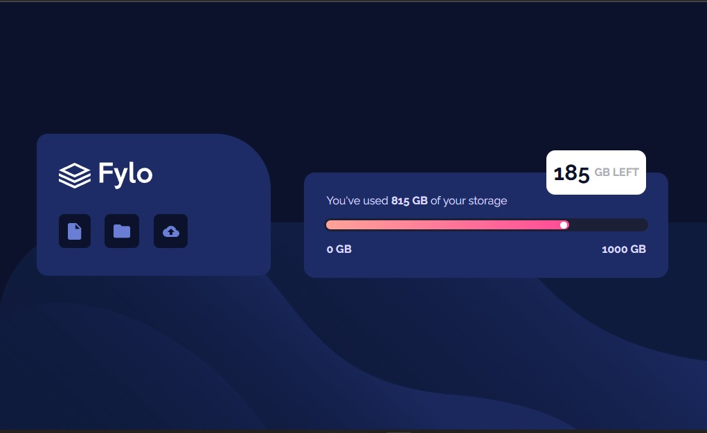

# Frontend Mentor - Fylo data storage component solution

This is a solution to the [Fylo data storage component challenge on Frontend Mentor](https://www.frontendmentor.io/challenges/fylo-data-storage-component-1dZPRbV5n). Frontend Mentor challenges help you improve your coding skills by building realistic projects. 

## Table of contents

- [Overview](#overview)
  - [The challenge](#the-challenge)
  - [Screenshot](#screenshot)
  - [Links](#links)
- [My process](#my-process)
  - [Built with](#built-with)
  - [What I learned](#what-i-learned)
  - [Continued development](#continued-development)
  - [Useful resources](#useful-resources)
- [Author](#author)

## Overview

### The challenge

Users should be able to:

- View the optimal layout for the site depending on their device's screen size

### Screenshot

### Links

- Solution URL: [Click here for see the repository!](https://github.com/maurocentu26/Fylo-data-storage-component-master)
- Live Site URL: [Click for see the page!](https://your-live-site-url.com](https://fylo-data-storage-component-master-kappa-umber.vercel.app)

## My process

### Built with

- Semantic HTML5 markup
- CSS custom properties
- Flexbox
- Mobile-first workflow

### What I learned

I learned a little more about the **widths/heights** of the containers in my document. The **responsive** part of the challenge is the tricky part, especially working with **relative** and **absolute** positions.
**Very satisfied** with the result.

### Continued development

This challenge made me realize that I still need to learn about responsive web design. Although I insist on following good CSS practices, I still have a hard time marking the limits of my containers.
So my focus from now on is going to be responsive design.

### Useful resources

Well, as always the Mozilla documentation helped a lot. The <a href="https://developer.mozilla.org/en-US/docs/Web/CSS/min-width" target="_blank">min/max-height/width</a> page was helpful in completing the challenge.

## Author

- Website - [Mauro Centurión](https://github.com/maurocentu26)
- Frontend Mentor - [@maurocentu26](https://www.frontendmentor.io/profile/maurocentu26)
